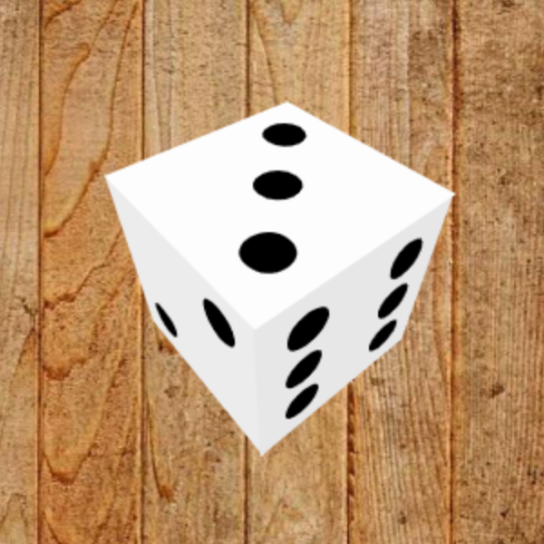

# Javascript 3D dice engine for online table games

Based on the original repository https://github.com/mimami24i/jsdice shown in the works in the [blog post](http://mimami24i.appspot.com/html5/ccrorin1) by the same author.



Dice is rendered using pre3d engine: http://deanm.github.com/pre3d/

## Deployment

This example displays a static 3D dice:

```html
<script type="text/javascript" src="ThirdParty/pre3d/pre3d.js" charset="UTF-8"></script>
<script type="text/javascript" src="ThirdParty/pre3d/pre3d_path_utils.js" charset="UTF-8"></script>
<script type="text/javascript" src="ThirdParty/pre3d/pre3d_shape_utils.js" charset="UTF-8"></script>
<script type="text/javascript" src="dice3d.js" charset="UTF-8"></script>
<script>
function makeDice()
{
	var canvas = document.createElement("canvas");
	canvas.width = window.innerWidth;
	canvas.height = window.innerHeight;

        var dice = document.getElementById("dice");
        dice.append(canvas);

	var dice3d = new midice3d.Dice(canvas, 0.9 /* scaling */);
  	dice3d.camFocLen = 0.7;
	dice3d.init();

	dice3d.draw(0, 3 /* dice top value */, 2 /* x offset */, 1 /* y offset */, false);
}
</script>
<body onload="makeDice()">
<div id="dice"></div>
</body>
```

## License

Free to use under the BSD license.

## Credits

mimami24im@gmail.com

